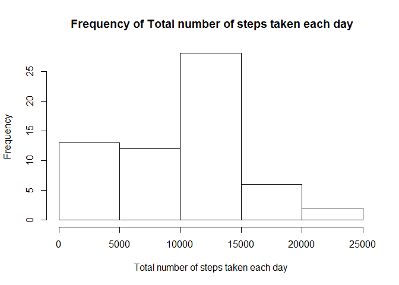

# Reproducible Research: Peer Assessment 1


## Loading and preprocessing the data

```r
data <- read.table(file="e:\\test2\\activity.csv",head=TRUE,sep=",")
```


## What is mean total number of steps taken per day?

```r
not_na_data <-subset(data,!is.na(data))
aggdata_steps_by_date <-aggregate(not_na_data$steps, by=list(not_na_data$date), FUN=sum, na.rm=TRUE)
hist(aggdata_steps_by_date$x,main= " Frequency of Total number of steps taken each day", xlab="Total number of steps taken each day")
```

 

```r
print(mean(aggdata_steps_by_date$x))
```

```
## [1] 10766.19
```

```r
print(median(aggdata_steps_by_date$x))
```

```
## [1] 10765
```

## What is the average daily activity pattern?

```r
aggdata_steps_by_interval <-aggregate(not_na_data$steps, by=list(not_na_data$interval), FUN=mean, na.rm=TRUE)
plot(aggdata_steps_by_interval$Group.1,aggdata_steps_by_interval$x, type='l',xlab="Interval", ylab="Average across all days")
```

 

```r
max_five_minute = which.max(aggdata_steps_by_interval$x)
p=aggdata_steps_by_interval[max_five_minute,]
print("max 5-minute interval, on average across all the days having max steps")
```

```
## [1] "max 5-minute interval, on average across all the days having max steps"
```

```r
print(p$Group.1)
```

```
## [1] 835
```


## Imputing missing values


## Are there differences in activity patterns between weekdays and weekends?
